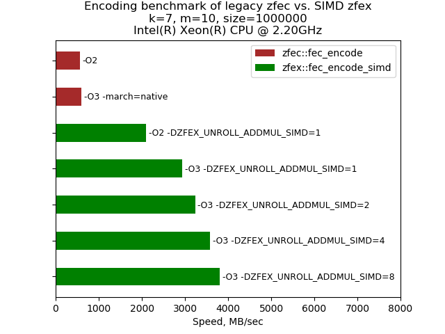
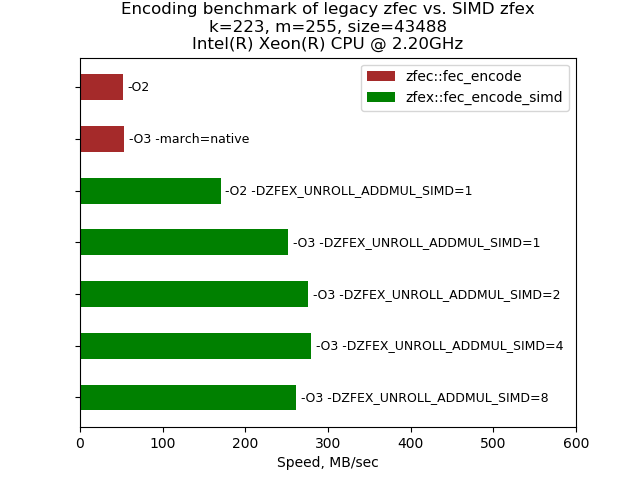

Benchmark results
=================

All benchmarks were executed using ``bench_zfex`` binary compiled for a given target. Executions were performed using attached scripts, ``legacy_zfec.sh`` and ``zfex.sh``.

Between different runs, results which had lowest difference between ``best`` and ``worst`` values were selected and ``mean`` value was used.

Intel x64
---------

This benchmark was run on virtualized instance of Intel(R) Xeon(R), clocked at 2.2 GHz.

::

  Architecture:                    x86_64
  CPU op-mode(s):                  32-bit, 64-bit
  Byte Order:                      Little Endian
  Address sizes:                   46 bits physical, 48 bits virtual
  CPU(s):                          4
  On-line CPU(s) list:             0-3
  Thread(s) per core:              2
  Core(s) per socket:              2
  Socket(s):                       1
  NUMA node(s):                    1
  Vendor ID:                       GenuineIntel
  CPU family:                      6
  Model:                           79
  Model name:                      Intel(R) Xeon(R) CPU @ 2.20GHz
  Stepping:                        0
  CPU MHz:                         2200.222
  BogoMIPS:                        4400.44
  Hypervisor vendor:               KVM
  Virtualization type:             full
  L1d cache:                       64 KiB
  L1i cache:                       64 KiB
  L2 cache:                        512 KiB
  L3 cache:                        55 MiB
  NUMA node0 CPU(s):               0-3
  Vulnerability Itlb multihit:     Not affected
  Vulnerability L1tf:              Mitigation; PTE Inversion
  Vulnerability Mds:               Mitigation; Clear CPU buffers; SMT Host state unknown
  Vulnerability Meltdown:          Mitigation; PTI
  Vulnerability Mmio stale data:   Vulnerable: Clear CPU buffers attempted, no microcode; SMT Host state unknown
  Vulnerability Retbleed:          Mitigation; IBRS
  Vulnerability Spec store bypass: Mitigation; Speculative Store Bypass disabled via prctl and seccomp
  Vulnerability Spectre v1:        Mitigation; usercopy/swapgs barriers and __user pointer sanitization
  Vulnerability Spectre v2:        Mitigation; IBRS, IBPB conditional, RSB filling
  Vulnerability Srbds:             Not affected
  Vulnerability Tsx async abort:   Mitigation; Clear CPU buffers; SMT Host state unknown
  Flags:                           fpu vme de pse tsc msr pae mce cx8 apic sep mtrr pge mca cmov pat pse36 clflush mmx fxsr sse sse2 ss ht syscall nx pdpe1gb rdtscp lm constant_tsc rep_good nopl xtopology nonstop_tsc cpuid tsc_known_freq pni pclmulqdq ssse3 fma cx16 pcid sse4_1 sse4_2 x2apic movbe popcnt aes xsave avx f16c rdrand hypervisor lahf_lm abm 3dnowprefetch invpcid_single pti ssbd ibrs ibpb stibp fsgsbase tsc_adjust bmi1 hle avx2 smep bmi2 erms invpcid rtm rdseed adx smap xsaveopt arat md_clear arch_capabilities

Compiler used was:

::

  gcc (Ubuntu 9.4.0-1ubuntu1~20.04.1) 9.4.0

For legacy ``zfec`` two results were picked, one for code compiled with ``-O2`` optimization, which is very likely binary code packaged with precompiled wheel packages, and the other one compiled with ``-O3 -march=native`` flags, which gave the best results.

``zfex`` benchmark was run for ``fec_encode_simd`` in five different configurations, one with ``-O2`` optimization and the other ones with ``-O3`` optimization. On top of that different variants of unrolling parameters were set.

k=7 m=10 size=1000000
~~~~~~~~~~~~~~~~~~~~~

|intel-7-10|

Legacy ``zfec`` had both results just below 600 MB/sec. ``zfex`` in all cases ran faster, achieving best performance with ``-DZFEX_UNROLL_ADDMUL_SIMD=8`` unrolling, running over 6 times faster at ~3800 MB/sec.

k=223 m=255 size=43488
~~~~~~~~~~~~~~~~~~~~~~

|intel-223-255|

Legacy ``zfec`` had both results slightly above 50 MB/sec. ``zfex`` in all cases ran faster, achieving best performance with ``-DZFEX_UNROLL_ADDMUL_SIMD=4`` unrolling, giving almost 6-fold speed-up.
